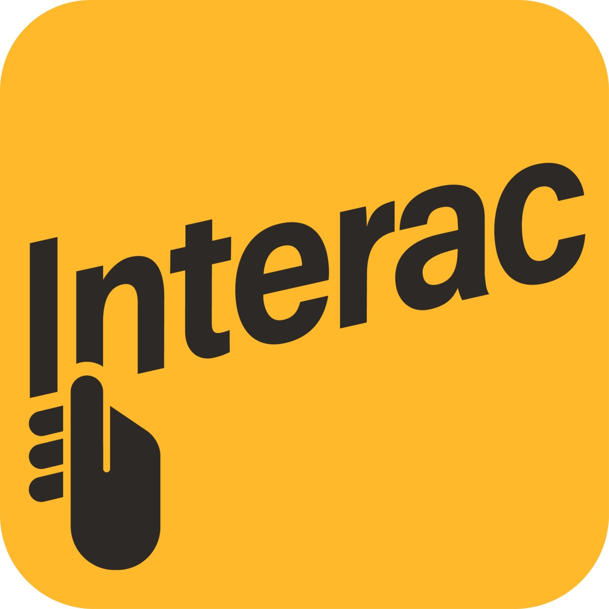

 
  

 I am a Math, Stats, CS student at the <a href="https://www.utoronto.ca/university-life/campuses/st-george" target="_blank">University of Toronto (St. George)</a>, who loves to use diverse algorithms and mathematics to solve difficult problems. In my free time, I love to golf and work on <a href="https://projecteuler.net/archives" target="_blank">these</a>.

 I previously attended <a href="https://www.albanyacademies.org/" target="_blank">The Albany Academies</a> where I spent my Grade 12 and Post Graduate year in New York with the opportunity to travel across the United States and play high-level hockey. I captained the Varsity Hockey Team and was involved in various activities such as Robotics Club, Student Ambassadors, Math Tutoring and was a Teacher Assistant for a 2nd Grade Class. 

---

## Work Experience 

> Data Science Intern at Interac Corp. {width="20"}
>>  May 2021 - September 2021
>>
> * Utilized Jira API to connect employee’s tasks, task life and other statistics with Planview for work management, written in Python - while following Clean Architecture guidelines and OOP, greatly increasing reliability and maintainability.
> * Created Tableau dashboards to efficiently display employee timesheets and Canadian’s spending habits - where the Tableau server was utilized to publish and share reports with the business users.
> * Wrote extensive documentation to aid maintainers and operators for Confluence pages. Smoothly handed off projects to the new interns.

> Full Stack Developer at SSD Group LTD. {width="35"}
>>  May 2020 - May 2021
>>
> *  Developed and designed a dynamic website using React and Node.js which automated incoming orders for PPE products and contained a fully functional contact form that filtered responses into a Google Sheet.
> * Designed and edited photos, videos and other graphics using Adobe After Effects and Photoshop to create appealing logos, advertisements and other branding material.

---

## Skills

#### Languages
Python, SQL (Postgres), JavaScript, HTML/CSS, R   

#### Frameworks 
React, Node.js, Flask, MongoDB, WordPress   

#### Developer Tools
Git, Docker, Google Cloud Platform, VS Code, Visual Studio, PyCharm, IntelliJ    
#### Libraries
pandas, patsy, statsmodels, NumPy, Matplotlib    

---

## This Site
This site was built using MkDocs which is a Python-based static site generator that uses markdown to create all the material shown on the site. I chose MkDocs as it is easy to deploy and allows for quick, live edits.    

